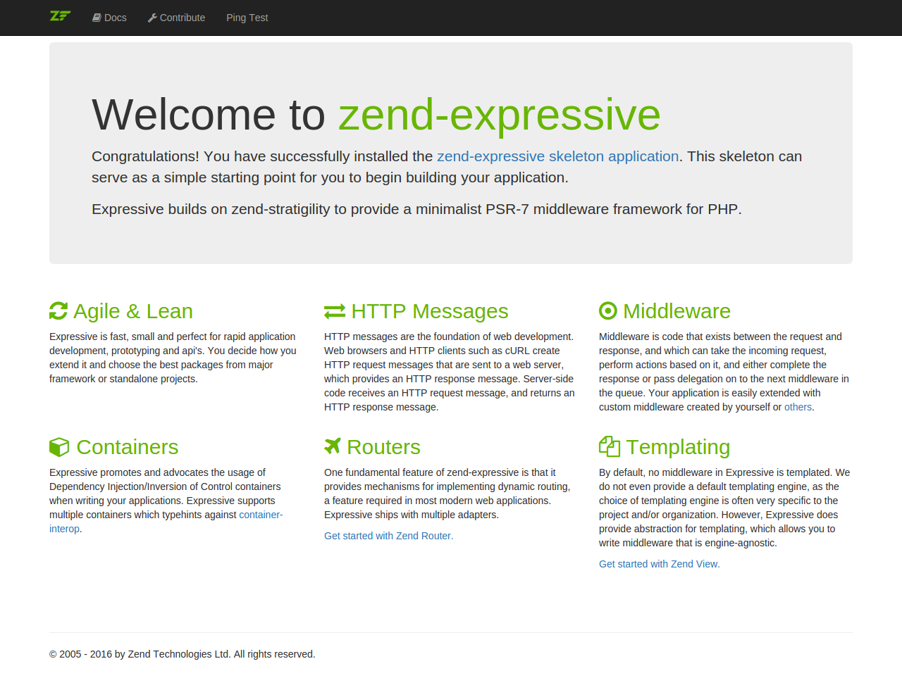

# Getting Started with Zend-Expressive applications

This tutorial is intended to give an introduction to using Zend Expessive by creating
 a simple database driven application using the [PSR-15](http://www.php-fig.org/psr/psr-15/) paradigm.
 By the end you will have a working ZF application, which you can then use as a starting point for your own applications.

## The tutorial application

The application that we are going to build is a simple inventory system to
display which albums we own. The main page will list our collection and allow us
to add, edit and delete CDs. We are going to need four pages in our website:

Page           | Description
-------------- | -----------
List of albums | This will display the list of albums and provide links to edit and delete them. Also, a link to enable adding new albums will be provided.
Add new album  | This page will provide a form for adding a new album.
Edit album     | This page will provide a form for editing an album.
Delete album   | This page will confirm that we want to delete an album and then delete it.

We will also need to store our data into a database. We will only need one table
with these fields in it:

Field name | Type         | Null? | Notes
---------- | ------------ | ----- | -----
id         | integer      | No    | Primary key, auto-increment
artist     | varchar(100) | No    |
title      | varchar(100) | No    |

# Setup the application

The easiest way to get started with Expressive is to use the [skeleton application and installer](https://github.com/zendframework/zend-expressive-skeleton).
The skeleton provides a generic structure for creating your applications, and prompts you to choose a router, dependency injection container, template renderer, and error handler from the outset.

## Create a new project

First, we'll create a new project, using [Composer](https://getcomposer.org/)'s `create-project` command:

````bash
$ composer create-project zendframework/zend-expressive-skeleton expressive-album
````

- [] step-by-step installation
- [x] Finish my changes
- [ ] Push my commits to GitHub
- [ ] Open a pull request

Once complete, enter the project directory:

````bash
$ cd zend-expressive-album
````

You can now startup PHP's [built-in web server](http://php.net/manual/en/features.commandline.webserver.php); the Expressive skeleton provides a short-cut for it via Composer:

````bash
$ composer serve
````

This starts up a web server on localhost port 8080; browse to [http://localhost:8080/](http://localhost:8080/) to see if your application responds correctly!

