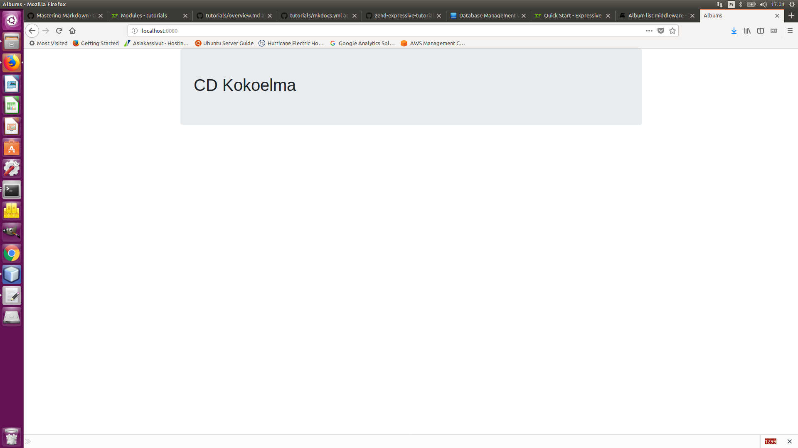

# Create Album list middleware

We will now setup a new middleware to show the album list. We will not have any data to display just yet, but the exercise will demonstrate writing your first middleware.

Create a `AlbumList` request handler. We can use our tooling to create the file:

````bash
$ composer expressive handler:create "App\Handler\HelloHandler"
````
The command will tell you the location in the filesystem in which it created the new class; 
 it will also create a factory for you, and register that factory with the container! 
Additionally, it will create a template file for you. make a note of the locations of both the class file and template file.

Open the class file, and now let's edit the `handle()` contents to read as follows:

````php
public function handle(ServerRequestInterface $request) : ResponseInterface
    {
        $data = [];

        return new HtmlResponse($this->renderer->render(
            'app::album-list',
            $data
        ));
    }
````
## Edit a template for listing albums

We now need a template file for the album list. Edit the template `templates/app/album-list.php`, placing the following content:

````php
<?php $this->headTitle('Albums'); ?>

<div class="jumbotron">
    <h1>CD Kokoelma</h1>
</div>
````

## Tell the application about the middleware and template

Currently, our Expressive application is unaware of the new action and template. Let's route our middleware and notify `plates` of our template.

Open the file config/routes.php, and add the following at the bottom of the function it exposes:

````php
$app->get('/', App\Handler\AlbumListHandler::class, 'album.list');
````

## Write tests

- [ ] Add tests

## Browse to the album list

Now that we have verified programmatically what we've written, let's see what we get in the browser!

If you do not have the built-in web server running, fire it up now:

````bash
$ composer serve
````

Now browse to [http://localhost:8080](http://localhost:8080) to see if the album page was setup properly.

