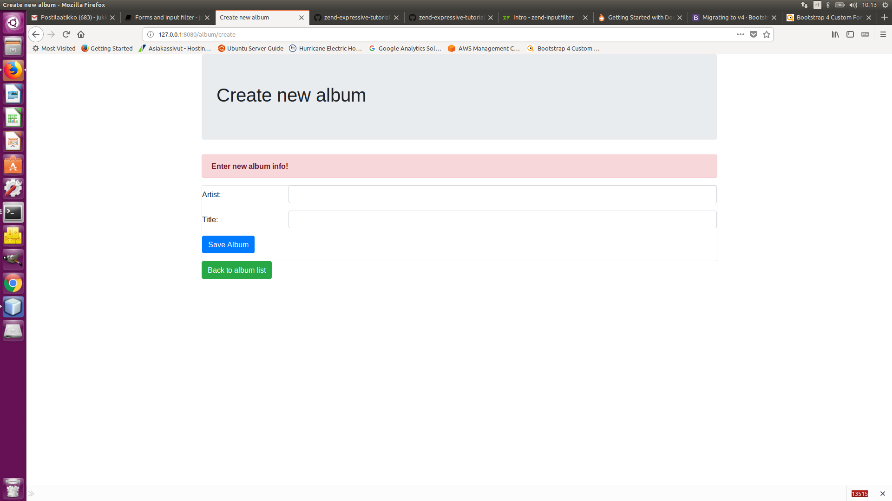

# Add a new album

In this part of the tutorial we will create an input filter and a form to allow the user of the album application to add new albums. We will also need to create some new middleware actions for the form display and handling.

## Create the album input filter

First, we need to create the album input filter. The `Zend\InputFilter` component can be used to filter and validate generic sets of input data. 

````bash
$ composer require zendframework/zend-inputfilter
````

Please create a new path `/src/App/Model/InputFilter/` and place the new `AlbumInputFilter.php` file in there. The `AlbumInputFilter` defines two input elements, one for the artist and one for the title. Both input elements are mandatory and get a set of filters and validators defined. The id does not need an input element.

````php
<?php
declare(strict_types=1);

namespace App\Model\InputFilter;

use Zend\InputFilter\InputFilter;

class AlbumInputFilter extends InputFilter
{
    public function init(): void
    {
        $this->add([
            'name'     => 'artist',
            'required' => true,
            'filters'  => [
                ['name' => 'StripTags'],
                ['name' => 'StringTrim'],
            ],
            'validators' => [
                'name'    => 'StringLength',
                'options' => [
                    'min' => 1,
                    'max' => 100,
                ],
            ],
        ]);

        $this->add([
            'name'     => 'title',
            'required' => true,
            'filters'  => [
                ['name' => 'StripTags'],
                ['name' => 'StringTrim'],
            ],
            'validators' => [
                'name'    => 'StringLength',
                'options' => [
                    'min' => 1,
                    'max' => 100,
                ],
            ],
        ]);
    }
}
````

Please note that the adding of the input elements is done in the `init()` method. This method is automatically called when the input filter is instantiated through the input filter manager. The input filter manager is a specialized service-manager just for input filter classes. We won't use the input filter manager in this tutorial. By implementing the `init()` method it will be much easier to setup the input filter manager in your project at a later time.

Please also note that we have filtering and validation now within the private setter-methods of the `AlbumEntity` and the `AlbumInputFilter`. This might look redundant, but there are good reasons for this.

- The `AlbumEntity` always makes sure that no invalid data is passed by throwing the exceptions. You cannot set a title with more than 100 chars
- The `AlbumInputFilter` also makes sure that no invalid data is passed by a form. While the exceptions within the `AlbumEntity` will be thrown one by one, the `AlbumInputFilter` always checks all input data and generates the error messages.
- This two-level filtering and validation is a common practice. You could compare it with JavaScript validation in the front end and PHP validation in the backend.

Of course the `AlbumInputFilter` will need a factory as will. So please create another `AlbumInputFilterFactory.php` file in the same path. The factory is just instantiating the `AlbumInputFilter` and running the `init()` method. If you need to add further configuration like some valid options for another input element you can inject that after instantiation and before the call of the `init() method.

````php
<?php

declare(strict_types=1);

namespace App\Model\InputFilter;

use Psr\Container\ContainerInterface;

/**
 * Description of AlbumInputFilterFactory
 *
 * @author jailgreen <36865973+jailgreen@users.noreply.github.com>
 */
class AlbumInputFilterFactory
{
    public function __invoke(ContainerInterface $container)
    {
        $inputFilter = new AlbumInputFilter();
        $inputFilter->init();

        return $inputFilter;
    }
}
````

## Create album form create handler

Please create the `AlbumCreateFormHandler.php` file in the existing `/src/App/src/Handler/` path. The `AlbumCreateFormHandler` is used to show the album form for creating new albums. 
It won't handle the form processing, it only passes the form to the template for rendering. And it sets a message depending on the current form validation state.

````bash
$composer expressive handler:create "App\Handler\AlbumCreateFormHandler"
````

Now, edit the generated `AlbumCreateFormHandler.php` file

````php
<?php

declare(strict_types=1);

namespace App\Handler;

use Psr\Http\Message\ResponseInterface;
use Psr\Http\Message\ServerRequestInterface;
use Psr\Http\Server\RequestHandlerInterface;
use Zend\Diactoros\Response\HtmlResponse;
use Zend\Expressive\Template\TemplateRendererInterface;

class AlbumCreateFormHandler implements RequestHandlerInterface
{
    /**
     * @var TemplateRendererInterface
     */
    private $renderer;

    public function __construct(TemplateRendererInterface $renderer)
    {
        $this->renderer = $renderer;
    }

    /**
     * {@inheritDoc}
     */
    public function handle(ServerRequestInterface $request) : ResponseInterface
    {
        // Do some work...
        // Render and return a response:
        return new HtmlResponse($this->renderer->render(
            'app::album-create-form',
            [] // parameters to pass to template
        ));
    }
}
````

- The `AlbumCreateFormHandler`has two dependencies. It needs the template renderer and an instance of the `AlbumInputFilter` which can both be injected to the constructor during instantiation.
- Within the `handle()` method it first checks if the form was validated with errors to set a different message. 
This is needed because the `AlbumCreateFormHandler` middleware will also be processed after the `AlbumCreateMiddleware` when the form validation failed (see the configuration for the route `album-create-handle` below).
- After setting a message both the form and the message are passed to the template renderer which renders the `album::create-form` template and passes the generated HTML to the `HtmlResponse`.

Also, edit the generated factory file:

````php
<?php

declare(strict_types=1);

namespace App\Handler;

use Psr\Container\ContainerInterface;
use Zend\Expressive\Template\TemplateRendererInterface;

class AlbumCreateFormHandlerFactory
{
    public function __invoke(ContainerInterface $container) : AlbumCreateFormHandler
    {
        return new AlbumCreateFormHandler($container->get(TemplateRendererInterface::class));
    }
}
````

## Create album create middleware

Now create `AlbumCreateMiddleware`. This middleware action is used for the form handling of the album form. It can only be accessed when a POST request is send to the path of the `album-create-handle` route (see the configuration for the route below).

````bash
$composer expressive middleware:create "App\Middleware\AlbumCreateMiddleware"
````

## Update album configuration

Next, we need to update the album configuration in the `ConfigProvider` and `config.routes.php`files.

In `CofigProvider`:
````php
/**
     * Returns the container dependencies
     */
    public function getDependencies() : array
    {
        return [
            'factories'  => [
                /* ... */

                Handler\AlbumCreateFormHandler::class => Handler\AlbumCreateFormHandlerFactory::class,
                Middleware\AlbumCreateMiddleware::class => Middleware\AlbumCreateMiddlewareFactory::class,

                /* ... */
    }
````

````php
return function (Application $app, MiddlewareFactory $factory, ContainerInterface $container) : void {
    $app->get('/', App\Handler\AlbumListHandler::class, 'album.list');
    $app->get('/album/create', App\Handler\AlbumCreateFormHandler::class, 'album.create');
    $app->post('/album/create/handle', [App\Middleware\AlbumCreateMiddleware::class], 'album.create.handle');
};
````

## Create album creation template

Next, you need to edit the `album-create-form.phtml` file in the existing `/templates/album/` path. This template should render the album data form.

````php
<?php
use App\Model\Entity\AlbumEntity;

$this->layout('layout::default', ['title' => 'Create new album']);
?>

<div class="jumbotron">
    <h1>Create new album</h1>
</div>

<div class="alert alert-danger">
    <strong><?php echo $message ?></strong>
</div>

<div class="card">
    <form class="form-horizontal" action="<?php echo $this->url('album.create.handle') ?>">
    <!--<div class="container">-->
        <div class="form-group form-row">
            <label for="artist" class="col-sm-2 col-form-label">Artist:</label>
            <div class="col-sm-10">
                <input type="text" class="form-control" id="artist" name="artist">
            </div>
        </div>
        
        <div class="form-group form-row">
            <label for="title" class="col-sm-2 col-form-label">Title:</label>
            <div class="col-sm-10">
                <input type="text" class="form-control" id="title" name="title">
            </div>
        </div>
        
        <div class="form-group form-row">
            <div class="col-sm-offset-2 col-sm-10">
                <button type="submit" class="btn btn-primary">Save Album</button>
            </div>
        </div>
    <!--</div>-->
    </form>
</div>

<p>
    <a href="<?php echo $this->url('album.list') ?>" class="btn btn-success">Back to album list</a>
</p>
````

## Add link to the album list page

Finally, you only need to add a link button to the album list page. Please open the `album-list.phtml` file. 
Add the link at the bottom of the page by using the url view helper with the `album.create` route.

````php
<p>
    <a href="<?php echo $this->url('album.create') ?>" class="btn btn-success">Create new album list</a>
</p>
````

Now you can browse to [http://localhost:8080/album/create](http://localhost:8080/album/create) to see if the album form is shown as expected. Please try to enter a new album with no data and with valid data and see what happens. If the creation of a new album is successful it will be displayed in the album list.

